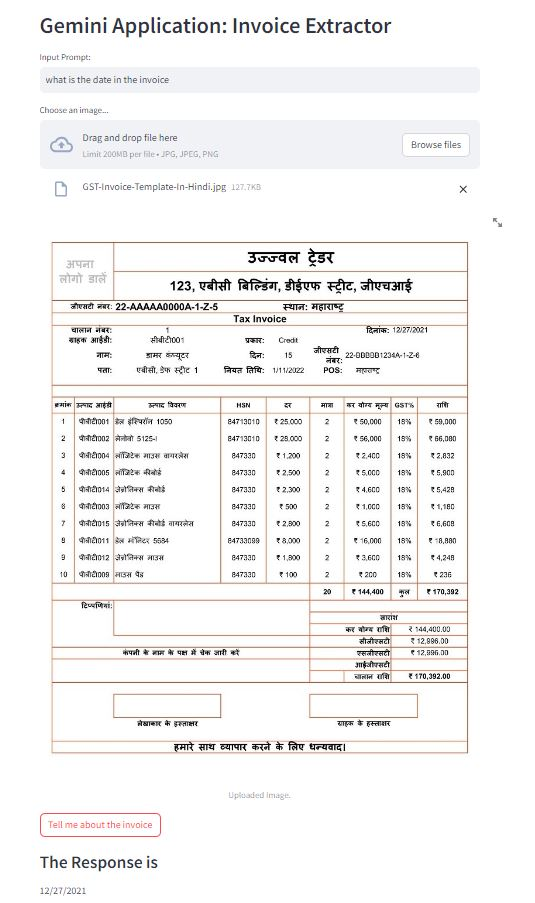
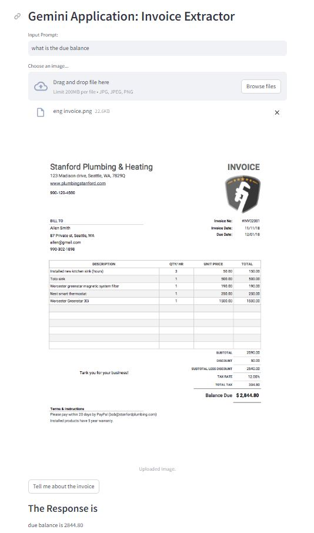

## Description
This is and end-to-end project about Invoice Extractor using Gemini Pro LLM Model.

## Gemini Configuration:
The Python SDK for the Gemini API, is contained in the google-generativeai package. 

## Setup API key
Before we can use the Gemini API, we must first obtain an API key.

## Project Structure
1. app.py: The main Python script containing the Streamlit application.
2. requirements.txt: contains the necessary packages
3. .env: Configuration file containing the API key for the Gemini API.

## Streamlit app:
User can upload an image and provide input in the prompt. When the "Tell me about the image" button is clicked, the app processes the input and image, calls the Gemini model, and displays the response.

## Demo

  

  

